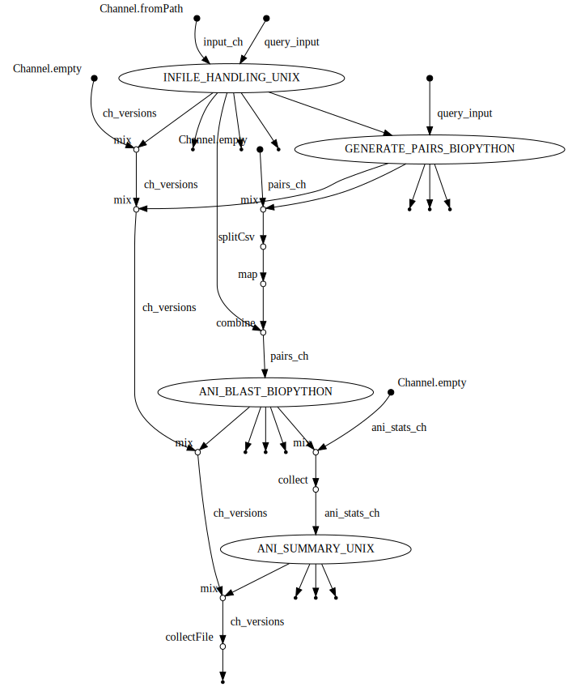

# Average Nucleotide Identity (ANI) Workflow


*General schematic of the steps in the workflow*

## Quick Start: Test
Run the built-in test set to confirm all parts are working as-expected. It will also download all dependencies to make subsequent runs much faster.
```
nextflow run \
  wf-ani \
  -r v1.0.0 \
  -profile YOURPROFILE,test
```

Test data [CP024957](https://ftp.ncbi.nlm.nih.gov/genomes/all/GCF/002/804/165/GCF_002804165.1_ASM280416v1/GCF_002804165.1_ASM280416v1_genomic.fna.gz) and [2BA6PG](https://ftp.ncbi.nlm.nih.gov/genomes/all/GCF/024/297/125/GCF_024297125.1_ASM2429712v1/GCF_024297125.1_ASM2429712v1_genomic.fna.gz) are from [Dataset of the complete genome of Streptomyces cavourensis strain 2BA6PGT isolated from sediment from the bottom of the salt lake Verkhnee Beloe (Buryatia, Russia)](https://www.sciencedirect.com/science/article/pii/S2352340922010800), where the expected output is `98.9%`.

## Quick Start: Run
Example command on genomes in "input-directory" data directory with singularity:
```
nextflow run \
  wf-ani \
  -r v1.0.0 \
  -profile singularity \
  --inpath input-directory \
  --outpath my-results
```

Example command on query "query-file" genome on genomes in "input-directory" data directory with singularity:
```
nextflow run \
  wf-ani \
  -r v1.0.0 \
  -profile singularity \
  --query query-file \
  --refdir input-directory \
  --outpath my-results
```

## Contents
- [Introduction](#Introduction)
- [Installation](#Installation)
- [Output File Structure](#Output-File-Structure)
- [Parameters](#parameters)
- [Quick Start](#Quick-Start-Test)
- [Resource Managers](#Resource-Managers)
- [Troubleshooting](#Troubleshooting)
- [Usage](#usage)
- [Workflow](#Workflow)

## Introduction
This workflow performs average nucleotide identity on genomes by fragmenting the genome sequence, searching the nucleotide sequence, gathering the alignment and performing identity calculation.

This procedure can be used on all FastA and Genbank files that have the extension `fa, fas, fsa, fna, fasta, gb, gbk, gbf, gbff` with optional gzip compression.

## Installation
- [Nextflow](https://www.nextflow.io/docs/latest/getstarted.html#installation) `>=21.10.3`
- [Docker](https://docs.docker.com/engine/installation/) or [Singularity](https://www.sylabs.io/guides/3.0/user-guide/) `>=3.8.0`
- [Conda](https://docs.conda.io/projects/conda/en/latest/user-guide/install/index.html) is currently unsupported

## Usage
Run ANI on all samples in a directory:
```
nextflow run wf-ani -profile <docker|singularity> --inpath <input directory> --outpath <directory for results>
```

Run ANI on a Query vs Reference directory:
```
nextflow run wf-ani -profile <docker|singularity> --query <input query file> --refdir <input directory> --outpath <directory for results>
```

## Parameters
Note the "`--`" long name arguments (e.g., `--help`, `--inpath`, `--outpath`) are generally specific to this workflow's options, whereas "`-`" long name options (e.g., `-help`, `-latest`, `-profile`) are general nextflow options.

These are the most pertinent options for this workflow:
```
  --inpath             Path to input data directory containing FastA/Genbank files. Recognized extensions are: fa, fas, fsa, fna, fasta, gb, gbk, gbf, gbff with optional gzip compression.

  --query              Path to query input data file that is FastA or Genbank. Recognized extensions are: fa, fas, fsa, fna, fasta, gb, gbk, gbf, gbff with optional gzip compression.

  --inpath             Path to input data directory containing FastA/Genbank files. Recognized extensions are: fa, fas, fsa, fna, fasta, gb, gbk, gbf, gbff with optional gzip compression.

  --outpath            The output directory where the results will be saved.

  -profile singularity Use Singularity images to run the workflow. Will pull and convert Docker images from Dockerhub if not locally available.

  -profile docker      Use Docker images to run the workflow. Will pull images from Dockerhub if not locally available.
```

View help menu of all workflow options:
```
nextflow run \
 wf-ani \
 -r v1.0.0 \
 --help
```

## Resource Managers
The most well-tested and supported is a Univa Grid Engine (UGE) job scheduler with Singularity for dependency handling.

1. UGE/SGE 
    - Additional tips for UGE processing are [here](docs/HPC-UGE-scheduler.md).
1. no scheduler

    - It has also been confirmed to work on desktop and laptop environments without a job scheduler using Docker with more tips [here](docs/local-device.md).

## Output File Structure
| Output Directory | Filename | Explanation |
| ---------------- | ---------------- | ---------------- |
| **Main output directory** | | **Main output directory**
| | ANI.Summary.tab | Bidirectional summary of all samples |
| | genomes.fofn | List of all input genomes |
| | pairs.fofn | List of all pairings of genomes in genomes.fofn |
| | nextflow_log.<job_ID>.txt | Log output from Nextflow |
| **ANI--\<Pair1\>,\<Pair2\>** | | **ANI Output of \<Pair1\> and \<Pair2\>** |
| | ani.\<Pair1\>,\<Pair2\>.stats.tab | ANI of each pair and their combined bidirectional ANI |
| | blast.\<Pair1\>,\<Pair2\>.tab | BLAST output of each fragment of \<Pair2\> vs reference \<Pair2\> |
| | blast.\<Pair1\>,\<Pair2\>.filt.tab | Filtered BLAST output |
| | blast.\<Pair1\>,\<Pair2\>.filt.two-way.tab | Filtered bidirectional BLAST output |
| **log** | | **Log files** |
| | ASM_\<Number of Samples\>.o\<Submission Number\> | HPC output report |
| | ASM_\<Number of Samples\>.e\<Submission Number\> | HPC error report |
| | pipeline_dag.\<YYYY-MM-DD_HH-MM-SS\>.html | Direct acrylic graph of workflow |
| | report.\<YYYY-MM-DD_HH-MM-SS\>.html | Nextflow summary report of workflow |
| | timeline.\<YYYY-MM-DD_HH-MM-SS\>.html | Nextflow execution timeline of each process in workflow |
| | trace.\<YYYY-MM-DD_HH-MM-SS\>.txt | Nextflow execution tracing of workflow, which includes percent of CPU and memory usage |
| | software_versions.yml | Versions of software used in each process |
| | errors.tsv | Errors file if errors exist and summarizes the errors |
| **log/process_logs** | | **Process log files** |
| | \<SampleName\>.\<ProcessName\>.command.out | Standard output for \<SampleName\> during process \<ProcessName\> |
| | \<SampleName\>.\<ProcessName\>.command.err | Standard error for \<SampleName\> during process \<ProcessName\> |


## Workflow
The complete directed acyclic graph (DAG) this workflow performs is this:


## Troubleshooting
Q: It failed, how do I find out what went wrong?

A: View file contents in the `<outpath>/log` directory.
