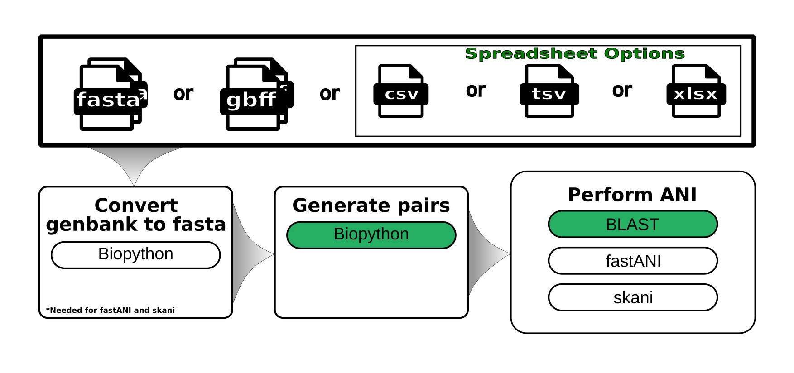

#  



_A schematic of the steps in the workflow._

## Requirements

- [Nextflow](https://www.nextflow.io/docs/latest/getstarted.html#installation) `(>=22.04.3)`
- [Docker](https://docs.docker.com/engine/installation/) or [Singularity](https://www.sylabs.io/guides/3.0/user-guide/) `(>=3.8.0)`

## Install on our HPC

```
git clone https://github.com/gregorysprenger/wf-ani.git $LAB_HOME/workflows
```

## Setup Singularity environment variables - For Aspen Cluster

```
# Add to $HOME/.bashrc
SINGULARITY_BASE=/scicomp/scratch/$USER

export SINGULARITY_TMPDIR=$SINGULARITY_BASE/singularity.tmp

export SINGULARITY_CACHEDIR=$SINGULARITY_BASE/singularity.cache

export NXF_SINGULARITY_CACHEDIR=$SINGULARITY_BASE/singularity.cache

mkdir -pv $SINGULARITY_TMPDIR $SINGULARITY_CACHEDIR
```

Reload .bashrc

```
source ~/.bashrc
```

# Run Workflow

Before running workflow on new data, the workflow should be ran on the built-in test data to make sure everything is working properly. It will also download all dependencies to make subsequent runs much faster.

```
cd $LAB_HOME/workflows/wf-ani

module load nextflow

nextflow run main.nf -profile singularity,test
```

To minimize typing all of the parameters above, a bash script was created for UGE HPCs. It can take FastA/Genbank files from selected directory OR if FastA/Genbank files not found in that directory, it will look in subdirectories for FastA/Genbank files. If an OUTPUT_DIRECTORY is not specified, the OUTPUT_DIRECTORY will default to where you launch the script.

## Usage

### Run all inputs against each other

```
# BLAST (ANIb)
run_ANIb_ALL_vs_ALL.uge-nextflow INPUT_DIRECTORY OUTPUT_DIRECTORY

# fastANI
run_fastANI_ALL_vs_ALL.uge-nextflow INPUT_DIRECTORY OUTPUT_DIRECTORY

# SKANI
run_skani_ALL_vs_ALL.uge-nextflow INPUT_DIRECTORY OUTPUT_DIRECTORY
```

Example analysis using Nextflow command:

```
nextflow run main.nf \
  -profile singularity \
  --input INPUT_DIRECTORY \
  --outdir OUTPUT_DIRECTORY \
  --ani <blast|fastani|skani>
```

### Run a query input against a reference directory of inputs

```
# BLAST (ANIb)
run_ANIb_QUERY_vs_REF.uge-nextflow QUERY_INPUT_FILE REFERENCE_DIRECTORY OUTPUT_DIRECTORY

# fastANI
run_fastANI_QUERY_vs_REF.uge-nextflow QUERY_INPUT_FILE REFERENCE_DIRECTORY OUTPUT_DIRECTORY

# SKANI
run_skani_QUERY_vs_REF.uge-nextflow QUERY_INPUT_FILE REFERENCE_DIRECTORY OUTPUT_DIRECTORY
```

Example analysis using Nextflow command:

```
nextflow run main.nf \
  -profile singularity \
  --query QUERY_INPUT_FILE \
  --refdir REFERENCE_DIRECTORY \
  --outdir OUTPUT_DIRECTORY \
  --ani <blast|fastani|skani>
```

### Help menu of all options:

```
nextflow run main.nf --help
```
