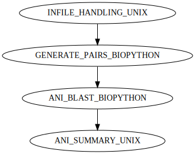

# Assembly Paired End Illumina Workflow




*A schematic of the steps in the workflow.*


## Requirements
* [`Nextflow`](https://www.nextflow.io/docs/latest/getstarted.html#installation) (`>=21.10.3`)
* [`Docker`](https://docs.docker.com/engine/installation/) or [`Singularity >=3.8.0`](https://www.sylabs.io/guides/3.0/user-guide/)


## Install Worflow Locally
```
git clone https://github.com/gregorysprenger/wf-ani.git
```


# Run Workflow
Before running workflow on new data, the workflow should be ran on the built-in test data to make sure everything is working properly. It will also download all dependencies to make subsequent runs much faster.

```
cd wf-ani/

nextflow run main.nf \
 -profile singularity,test
```


Example data are included in assets/test_data directory.

```
nextflow run main.nf \
 -profile singularity \
 --inpath assets/test_data \
 --outpath results
```

When running locally, `--max_cpus` and `--max_memory` may need to be specified. Below, max cpus is set to 4 and max memory is set to 16 (for 16GB).

```
nextflow run main.nf \
 -profile singularity \
 --inpath assets/test_data \
 --outpath results \
 --max_cpus 4 \
 --max_memory 16
```

Help menu of all options:

```
nextflow run main.nf --help
```

Test data [CP024957](https://ftp.ncbi.nlm.nih.gov/genomes/all/GCF/002/804/165/GCF_002804165.1_ASM280416v1/GCF_002804165.1_ASM280416v1_genomic.fna.gz) and [2BA6PG](https://ftp.ncbi.nlm.nih.gov/genomes/all/GCF/024/297/125/GCF_024297125.1_ASM2429712v1/GCF_024297125.1_ASM2429712v1_genomic.fna.gz) are from [Dataset of the complete genome of Streptomyces cavourensis strain 2BA6PGT isolated from sediment from the bottom of the salt lake Verkhnee Beloe (Buryatia, Russia)](https://www.sciencedirect.com/science/article/pii/S2352340922010800), where the expected output is `98.9%`.
